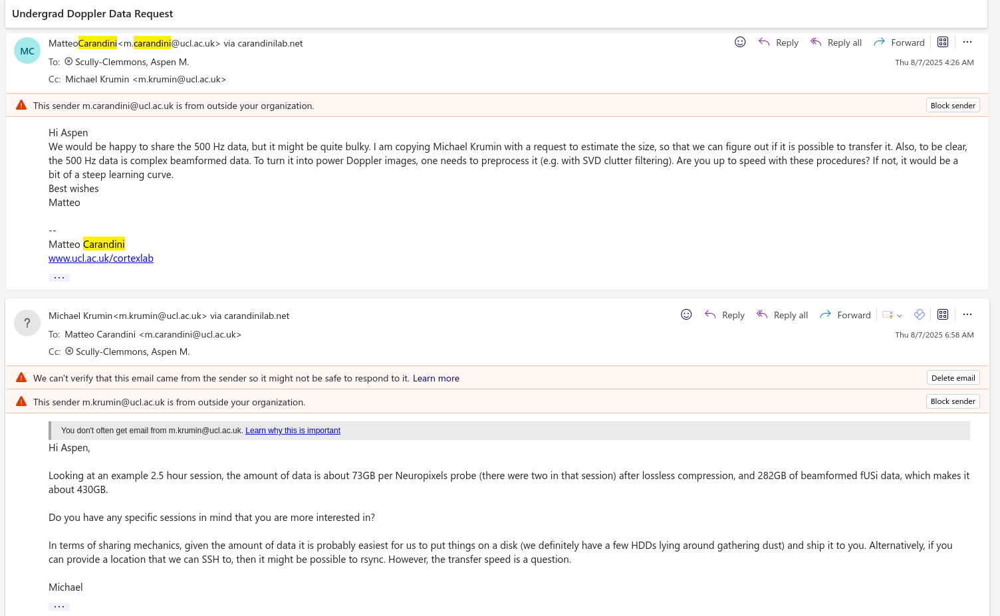
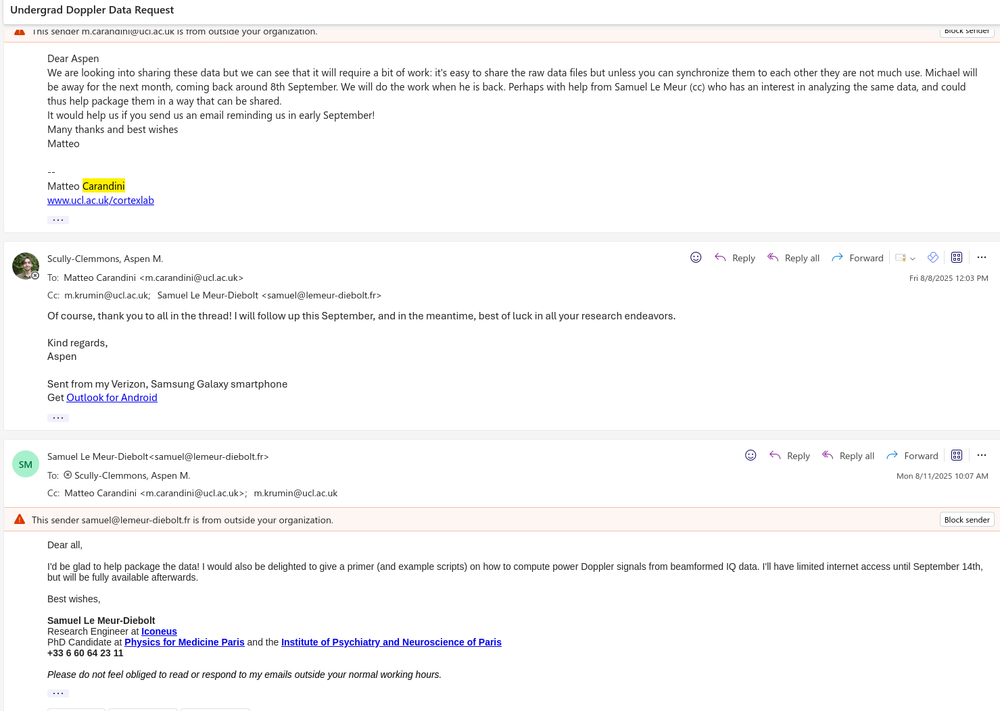

Acquiring Brain Data for Southern
==================================
Real world brain data is messy, difficult to work with, and extremely memory intensive. Yet, working with and understanding the brain is imperative for anyone seriously considering psychology, because it provides an appreciation for the complex, chaotic, and beautifully mysterious system that continues to defy our neat categories. To this end, I have performed extensive outreach over the summer to make prerecorded neural data available for access and processing by members of the Southern Connecticut State University community towards future analysis during the academic year.

Southern does not currently have neuroimaging capability, which limits the experimental research that can be conducted on campus. However, I wanted to see if there were existing datasets that first year psychology students could work with, without the need for running the trials themselves. Replication studies are essential components of the scientific ecosystem. These studies do not seek to investigate a new research question, rather, they aim to reproduce the methodology of an existing study in service of determining whether the results are consistent and the experiment is valid. Replication studies also offer a valuable hands-on opportunity to work with pre-recorded datasets. As part of this project, I have obtained access to the data from the study, “Neural correlates of blood flow measured by ultrasound” through principal investigator Matteo Caradini. This data, which represents about 2 terabytes of single neuron recordings in addition to bloodflow, is currently being processed and is scheduled to be shared in early September.

