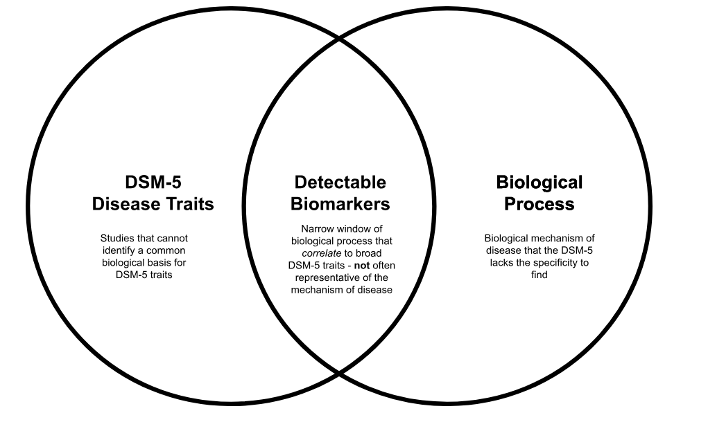

A History of the DSM
====================

The first efforts to name and categorize mental illness in America were undertaken by the American Psychiatric Association (APA), a private organization, and the United States Census Bureau, in an effort to quantify the number of institutionalized Americans. The dominant paradigm at the time of authorship of the DSM, then called the Statistical Manual for the Use of Institutions for the Insane, was that mental illnesses were the result of physiological disturbance, and that mental illness had a clear, causal link to biology. This first categorical manual identified 22 unique diseases. The arrival of psychodynamic theory from Europe in the first quarter of the 20th century introduced the idea that developmental and environmental conditions can also contribute to the development of mental illness. In 1952, the 1st edition of the Diagnostic and Statistical Manual (DSM-1) was released and identified 102 unique diseases in two groups: environmental and biological. The DSM-2 further subdivided these diseases into 182 unique categories and ranked them in terms of severity. Released in 1980, the DSM-3 was the first edition of the manual created based partially on the statistical regularities of disease traits, instead of the arbitrary classification system that had emerged from clinical intuition over time and comprised the majority of the DSM-1 and DSM-2 (Kawa & Giordano 2012). 

The Research Diagnostic Criteria (RDC) anchored nosology (the practice of naming diseases) in replicable combinations of disease traits that could be observed with high inter-rater reliability. Because the DSM-3 was trait based and simply identified clusters of co-occurring symptoms, it was thought to be a valuable starting place to study the underlying biology of each cluster. However, this was quickly determined not to be true. There was generally poor correspondence between DSM categories and biomarkers of mental illness (Easley & Hannon, 2025). But why?

