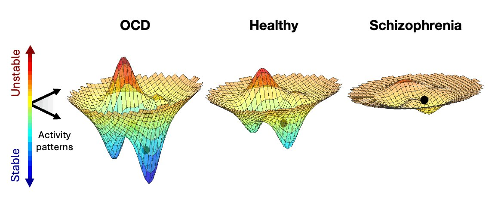

Dynamical View of Mental Illness
=================================
Mental processes, and consequently, mental illnesses, can best be understood as transitions along a continuum of metastable states (Meyer-Ortmanns, 2023). Some systems are only stable in one particular configuration. Other systems have many points of stability. These systems are called multistable. Multistability is a trait common to many complex systems, and it likely occurs in the brain. Setting aside the underlying computational rules the brain performs, we know the brain is a complex system. This allows us to make certain well-founded assumptions about its behavior at large scales, even if we don’t know the underlying rules that lead to the emergence of those behaviors. An energy landscape is an intuitive way to think about multistability in the brain, in which there are basins of pathology and basins of stability, rather than categorical disease labels. There is increasing evidence that canalization, that the degree of cognitive flexibility between distinct trait clusters which can be conceptualized as the “depth” of each potential well, can adequately explain many existing mental illnesses (Carhartt-Harris et. al. 2023)

