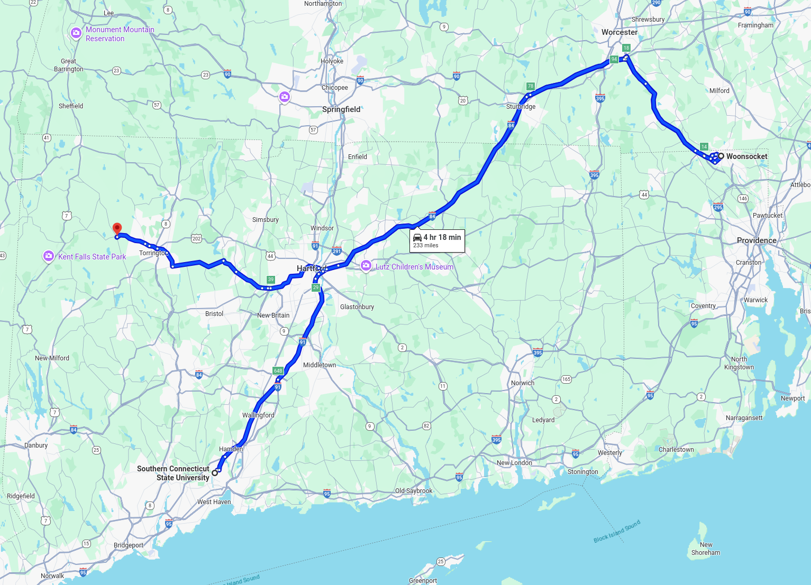

Building a High Performance Computer for Southern Students
==========================================================
It quickly became clear that creating a tutorial pipeline for psychology students at Southern would not be as easy as providing a simple web resource, because neuroimaging datasets require significant storage capacity and designated random access memory (RAM) orders of magnitude above what most students at Southern have access to on their home machines. Fortunately, it is possible for students to access a centralized, powerful machine from their own devices, from which they can perform more detailed data analysis. This is the premise of high performance computing - a server, or remote machine capable of performing memory-intensive calculations, and returning their results to a user. The idea to create a high performance computer came from the SCSU Center for Nanotechnology, which uses this workflow regularly to perform intensive chemical calculations. Southern does have plans for a designated, student-directed high performance computing center, but it is not currently in operation. Consequently, to enable data analysis in September, it was necessary to construct one.

A video of the buildout:
https://youtube.com/shorts/jGBCsUsmjJs?si=f2gbr5Pi5DMReAgs

.. image:: 1.png
   :width: 600

I did not want to spend money on this project, so I looked for decommissioned servers that I could reconfigure into a high performance computing device. Periodically, law firms and internet service providers replace their network infrastructure in bulk. Because the supply of old servers rapidly outpaces demand, and because outside of industry, this is not common information, many of these servers end up as e-waste. Servers are computers specifically designed to process large volumes of data, simultaneously, from many users. Generally, they are not configured with very much active memory. These machines are impractically large for home use, extremely loud, and heavy, which means they exist in a separate market from most other computing technology. However, because of their applications in network and data center use, they are very easy to reconfigure and add more memory to. Modern computers use Double Data Rate Fourth Generation (DDR4) RAM, which is expensive and scarce. However, Double Data Rate Third Generation (DDR3) RAM was commonly used in older data centers, and is available in abundance. Each module contains less memory, so it is generally impractical for home users to benefit from this massive excess - unless they have access to a decommissioned server. To this end, I drove to Woonsocket, RI, to pick up a decommissioned server, and then to Goshen, CT, to pick up decommissioned RAM. Final operational checks are proceeding on time for the server to come online in early September, for the free use and benefit of any interested student at Southern to process brain data.

.. image:: 2.png
   :width: 600

.. image:: 3.png
   :width: 600

.. image:: 4.png
   :width: 600

.. image:: 5.png
   :width: 600

.. image:: 6.png
   :width: 600

In line with the aims of Southern Connecticut State University’s new neuroscience program, this project will continue to be updated throughout the year as data is made available.
