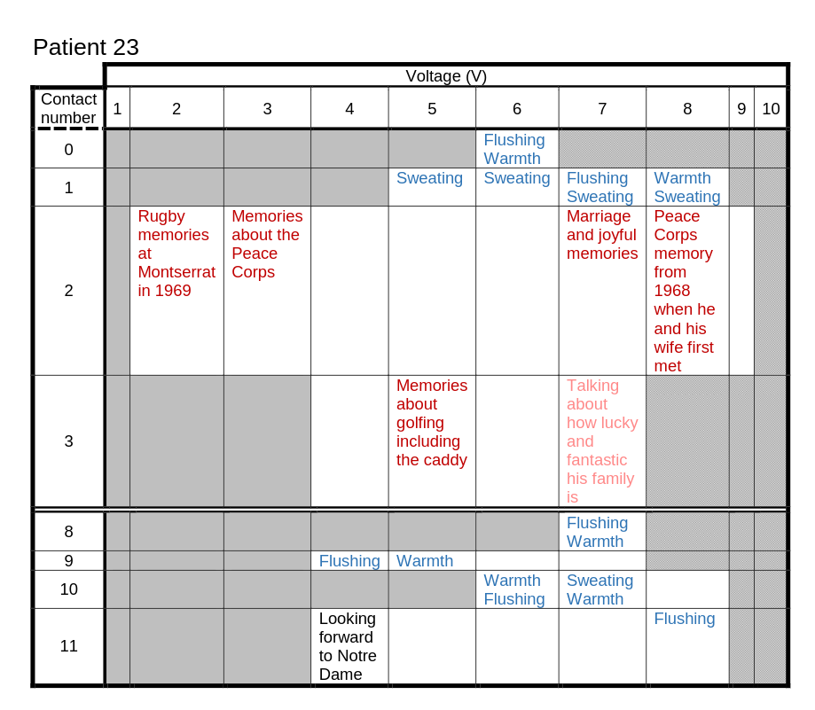

Establishing a Correspondence: Return to Reductionism!
======================================================

Introspection is a powerful tool to determine and report the feeling of mental content, but it lacks specificity. It can be difficult to tell whether one person’s description of a mental process is consistent with another person’s. There is good evidence that there is a shared encoding structure between brains, even if individual differences in mental content occur (Doerig et. al. 2025). However, causation cannot reliably be established when describing inner events, only correlation. The last decade has seen the emergence of a new technology called targeted brain stimulation. It is now possible to target specific regions of the brain with weak current or ultrasound, patterned in the same way as the neural code. This can produce vivid inner experience, and allow for the empirical probing of which neural circuits produce which feeling states. In one recent study, distinct, deliberate sensations, emotions, and complex mental states were induced in this manner (Deeb et. al. 2020).

Rather than relying on subjective self reporting, targeted brain stimulation provides experimenters the ability to directly observe the impact of introducing patterned information at specific timepoints along a neural computation. For the first time, we are able to meaningfully “join the conversation” in the brain, rather than simply listening in. As with any language, this immersion is what will allow us to create a shared lexicon between the language of felt or introspected inner experience, and the underlying patterns of neural activity that give rise to those inner states. 

.. image:: pt2.png
   :width: 600

We have now returned to the reductionist paradigm: in the same way the neuroscientists of the late 20th century were able to accurately describe the correspondence between neural activity, movement, and vision, we are on our way to being able to atomize feeling states and create a dictionary of emotional experience. Of course, such an effort will never be fully comprehensive, but the utility of a shared vocabulary cannot be understated. The computations underlying inner experience seem to happen at a smaller scale than the predictors of that experience. In other words, in order to have a meaningful dialogue with the neural code itself, the traditional approach of finding one or two “reporter” signals will likely be insufficient. Instead, the direct deconvolution and recording of the neural code across the brain, in real time, and from many individual neurons will likely be necessary to elucidate the underlying computational basis of canalization.

