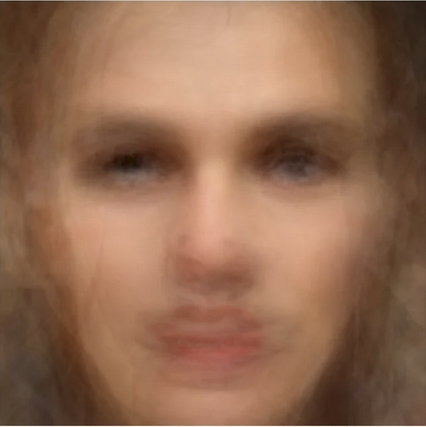

In this rapid and changing landscape, it will be to your benefit to familiarize yourself with the tools and techniques used in this kind of science. Even if your clinical practice does not relate directly to research or analysis, fluency with decoding neural data from these types of trials will help you understand how to describe disease states in specific, narrow, and personal terms. 

To this end, it is essential to learn the best practices for network neuroscience. Changes in the brain that reflect internal states of distress are transient, different between people, and highly dependent on tracking the time and pattern of neuron activations across the brain. This does not mean they are not detectable, it means they must be detected according to a specific set of rules.

The process of averaging data across participants can make it seem like there is no consistent biomarker that can be used to identify a presentation of symptoms above chance, when in fact there are multiple biomarkers that can be used. These biomarkers are sensitive to the time, evolution across the brain, and individual from which they are recorded (Tozzi et. al. 2025). Because multiple brain regions are involved that may be different at different times across participants, these signatures can cancel one another out when studied in aggregate (Easley & Hannon, 2025). Taking an average is acceptable when strong, consistent features are present in a sample. The average of many faces is still, identifiably, a face, because the dimensions along which a face can change are relatively small:

However, the more parameters that can vary within a sample, the more perilous it becomes to take an average. It would be inaccurate to say there are no shared characteristics in the works of Rembrandt and Van Gogh, but because the number of parameters that change between each painting is so large, an average of these paintings does not reveal meaningful data, only noise. It is the wrong mathematical inquiry to make, because the structure of the differences occur at a higher dimensionality than the method used to simplify them. The same is true when seeking differences in brain data.

